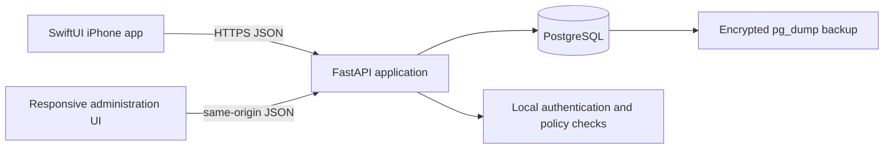
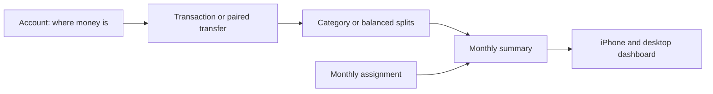
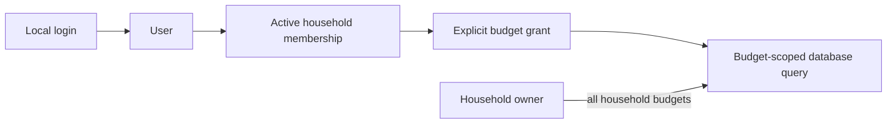
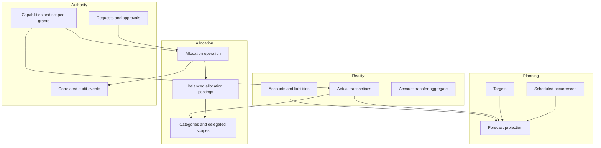

# Architecture review and financial-engine evolution

Reviewed against the repository at `v0.1.0`. The referenced YNAB material is used only as conceptual background for intentional allocation; this project retains its own language, UI, implementation, and self-hosted product model.

## Current architecture

- `BudgetCore` is a dependency-free Swift package for exact money, monthly calculations, and client-side permission hints.
- `BudgetAPI` is the typed iPhone API client. Access and rotating refresh tokens are stored in Keychain.
- FastAPI is authoritative for authentication, authorization, ledger writes, and summaries.
- SQLAlchemy models are migrated with Alembic. PostgreSQL is production; SQLite is limited to tests.
- The administration UI is dependency-free HTML/CSS/JavaScript served by FastAPI.
- Docker Compose runs one API container and PostgreSQL. No subscription, billing, analytics, or required cloud service exists.

## Current financial model and data flow

- Money is represented as signed 64-bit minor units. Expenses are negative; inflows and refunds are positive.
- Accounts and categories both belong to a budget. Tracking accounts are excluded from money available to assign.
- An uncategorized, non-transfer transaction in an on-budget account changes Ready to Assign.
- Categorized transaction activity changes category availability.
- Monthly assignments reduce Ready to Assign and increase category availability.
- Category availability is derived across all prior assignments and activity, so balances already roll forward.
- Account transfers create equal and opposite transactions with one transfer identifier. They do not affect category activity or Ready to Assign.
- Reconciliation derives the cleared balance and marks matching transactions reconciled only when it equals the statement balance.

## Current identity and authorization flow

- A user may belong to multiple households; the installation and household are not conflated.
- Household roles are owner, adult, and child, but non-owner financial authority comes from explicit budget grants.
- View, Contribute, and Manage permissions form a coarse hierarchy. Only the owner changes sharing.
- Missing grants hide budgets and return the same 404 shape as nonexistent budgets.
- Deactivation removes grants while preserving transactions attributed to the user.
- Authorization is server-side; UI hiding is only presentation.

## What already aligns and should remain

1. Household IDs on ownership roots and explicit memberships provide a sound isolation boundary.
2. Deny-by-default budget discovery and scoped queries correctly protect sibling budgets.
3. Integer minor units and date-only financial dates are correct foundations.
4. Derived category balances already accumulate across month boundaries.
5. Account transfers are paired and excluded from income and spending calculations.
6. Split totals are validated before persistence.
7. Authentication is local, Argon2-based, throttled, and uses rotating hashed refresh secrets.
8. PostgreSQL, migrations, private CI, encrypted backups, and formula-safe exports fit user-owned deployment.
9. The existing visual identity and lightweight clients can evolve without a rewrite.

## Gaps and dangerous debt

### Financial consistency

- `MonthlyAssignment` is a mutable row. Updating it erases why, when, and by whom money moved.
- There is no first-class category-to-category allocation transfer.
- Allocation writes have no optimistic version or database lock, so two planners can overwrite each other.
- Transaction pairs share a string identifier but lack a transfer aggregate or database-level completeness constraint.
- Split balancing and cross-budget consistency are enforced only in route code, not by a reusable domain service.
- Accounts lack explicit opening-balance provenance and the API lacks cleared/uncleared/working balance summaries.
- Transactions cannot be corrected through an auditable void/reversal workflow.

### Household authority

- Budget grants are coarse role-like bundles rather than explicit capabilities.
- Account and category visibility cannot yet be restricted within one shared household ledger.
- Physical accounts belong directly to a budget. Treating every delegated view as another budget would duplicate cash; delegated scopes must instead reference allocation in an authoritative household book.
- Spouse co-administration, delegated categories, requests, approvals, allowances, and audit events are absent.

### Planning and liabilities

- Actual and forecast records are not yet explicitly separated because scheduled transactions do not exist.
- Targets, recommended funding, recurrence, and priorities are absent.
- Credit accounts are labels only. Purchases do not reserve funded cash for payment, and payments have no liability-specific semantics.
- Reconciliation has no explicit adjustment event when the owner accepts a discrepancy.

### Operations and clients

- CSV exists, but a structured JSON portability export is still missing.
- Backup scheduling remains an owner/host responsibility.
- The iPhone app has no offline read cache yet.
- Docker and PostgreSQL are verified in CI, but physical-phone signing and final-host restore testing necessarily remain owner acceptance tasks.

## Target architecture

Keep one deployable application and one relational database. Add domain services and append-only financial records inside the existing FastAPI process.

### Allocation ledger

An allocation operation is an immutable header with actor, effective financial date, kind, note, source, and optional correlation. It owns two or more postings. A posting points either to a category or to the Ready-to-Assign pool and carries signed minor units. Postings for one operation must sum to zero.

- Assign money: Ready to Assign `-10000`; Groceries `+10000`.
- Move money: Dining `-5000`; Fuel `+5000`.
- Reverse a mistake: append the exact opposite operation; never erase history.
- Delegate money: Household Allowance Pool `-2000`; delegated Child Spending category `+2000`.

Existing monthly assignments migrate into balanced operations without losing their dates or amounts. The legacy table remains only for migration compatibility and is no longer a mutable source of truth after cutover.

### Authoritative cash

Actual account balances remain derived from posted, non-void transactions. Ready to Assign begins with actual uncategorized cash activity in on-budget asset accounts and is then changed by its allocation postings. Scheduled and forecast records live in separate tables and queries and never enter these calculations.

### Household financial scopes

An ordinary shared household budget remains the authoritative book. Individual, restricted, and delegated experiences are views over explicitly scoped accounts/categories and allocation authority, not duplicate money. Additional independent books remain valid only for genuinely separate finances and must not be presented as delegated portions of another book.

## Migration requirements

1. Add immutable allocation operations/postings and a budget allocation version.
2. Backfill every monthly assignment into a balanced operation using its budget currency and month.
3. Cut summary calculations and assignment endpoints over to postings; preserve response compatibility.
4. Add targets and scheduled records in separate planning tables.
5. Add liability metadata and reserved-payment categories without reclassifying existing credit history automatically; owners must explicitly establish opening card debt.
6. Add capability/scoped-grant tables alongside current budget grants, then translate existing permissions into capability bundles at authorization time.
7. Add delegated-category ownership, requests/approvals, and audit correlations without copying transactions or cash.
8. Keep every migration forward-only and data preserving. No destructive reset is justified for the existing repository.

### Implemented liability checkpoint

Migration `0008` adds one linked system payment category per credit account and backfills those links for existing cards without rewriting their historical transactions or asserting that old debt is funded. New categorized purchases create immutable reserve events for the amount that was actually available in the spending category. Refunds release that reserve. Card payments are paired account transfers plus reserve consumption, so they reduce cash and liability without recording a second expense. Existing debt is payable only after an explicit allocation to the linked payment category.

This implementation deliberately keeps three quantities distinct: the signed credit-account liability, the allocation available for card payment, and physical cash in on-budget asset accounts. None can be inferred by silently mutating another. Reconciliation follows the same rule: a mismatch is rejected unless the owner explicitly requests a visible adjustment transaction with actor and reason.

### Implemented delegated-access checkpoint

Migration `0009` layers configurable capabilities and resource scopes over the existing grant model. Existing grants remain compatible bundles until an owner creates an explicit profile. Profiles can independently restrict account and category IDs; every affected server query applies those restrictions, and balance/forecast access is separate from account-name visibility. A delegated category points to a household user but remains in the same authoritative budget and allocation ledger.

Funding and purchase requests are durable domain records with status, version, requester, amount, category, reason, timestamps, resolution data, and immutable actions. Approval locks both the request and allocation budget, verifies the request version and source availability, then creates a balanced category-to-category allocation operation. The unique operation link and terminal request state make approval single-winner under concurrent PostgreSQL requests. Rejection, change requests, cancellation, partial approval, and deactivated-user attribution remain preserved without inventing money.

## Implementation order

1. Allocation ledger, assignment compatibility, category transfers, versions/locking, rollover and invariant tests.
2. Category targets and funding recommendations.
3. Scheduled/recurring transactions and forecast-only projections.
4. Credit-card funded-spending reserve, payments, refunds, debt and reconciliation behavior.
5. Capability policies and finer account/category scopes.
6. Delegated allocations, allowances, requests, partial approvals, concurrency protection, and correlated audit history.
7. Client workflows, structured exports, full migration/container verification, and documentation consolidation.

## Invariants to enforce

- Actual and forecast money are queried and calculated separately.
- Account transfers net to zero across the budget and never alter allocation.
- Allocation operations balance to zero and never alter physical cash.
- Category availability is reconstructable from immutable postings and transaction activity.
- Credit-card payments change cash and liability balances but do not create spending.
- Split components equal the parent transaction amount.
- Delegation and approval move existing allocation and never create income or bank transactions.
- One approved request links to at most one allocation operation; concurrent approval is single-winner.
- Every protected resource is resolved through household and financial-scope policy.
- Disabling a member preserves attributed financial and audit records.

## Intentionally deferred

Advanced scenario modeling, recommendation ranking, behavioral analytics, chores, OCR, institution sync, notification infrastructure, and AI mutations remain future layers. Their inputs will be structured projections and ledger summaries; they do not justify microservices, event sourcing, or cloud dependencies now.
